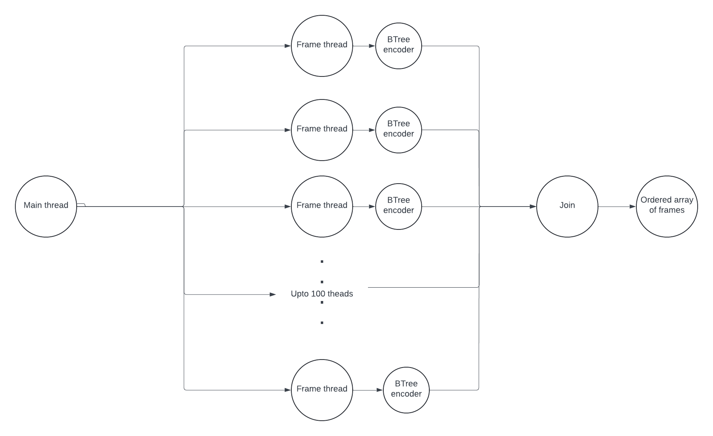
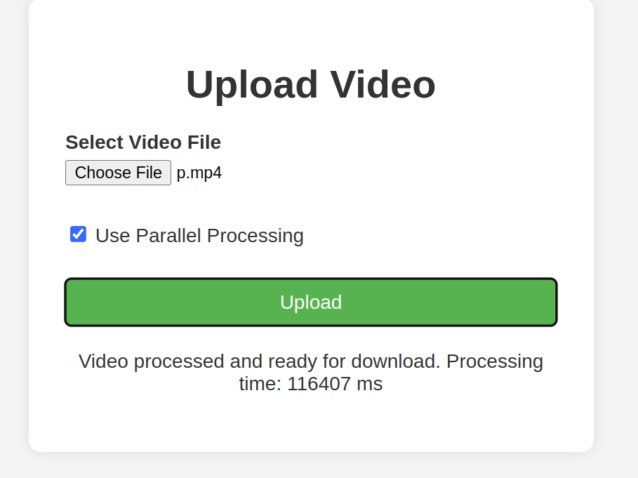
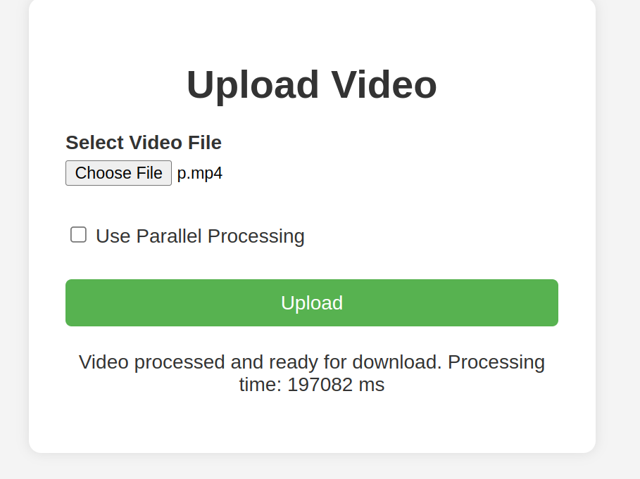

---------
---------

# Universidad Nacional Autónoma de México 

## Facultad de Estudios Superiores Acatlán 

## Licenciatura en Matematicas aplicadas y computacion

#### Video Compression

#### Segura Díaz Angel Daniel
#### Sevilla Gallardo Saúl Sebastián

#### Profesor: Pablo Martínez Castro (MACAPPA)

---------
---------
# Implementation of a video compressor using B-Tree Triangular Coding.

As we know, a viode can be tought as a series of 
ordered images, called frames. This we can compress each of this images in order to compress
the full video. In this particular case we are implementiong the B-Tree Triangular Coding for 
each frame.

### Mathematical Model

The B-Tree Triangular Coding (BTTC) algorithm utilizes a hierarchical decomposition of an image into triangular regions, leveraging the B-Tree structure to manage and encode these regions effectively. Below is a detailed explanation of the mathematical model underlying the BTTC algorithm.

#### 1. **Triangular Decomposition**

Given an image $ I $ with dimensions $ W \times H $, the initial step involves decomposing $ I $ into a set of right-angled triangles. Each triangle is defined by three vertices:
$ T_i = \{(x_1, y_1), (x_2, y_2), (x_3, y_3)\} $

#### 2. **Uniformity Testing**

For each triangular region $ T_i $, we test its uniformity. A triangle is considered uniform if the color of all its pixels is approximately the same. Mathematically, we can define a uniformity condition as:
$ \forall (x, y) \in T_i, \ |C(x, y) - C(x_1, y_1)| \leq \epsilon $
where $ C(x, y) $ is the color at pixel $ (x, y) $ and $ \epsilon $ is a predefined threshold.

#### 3. **B-Tree Structure**

The B-Tree manages the hierarchical decomposition of triangles. Each node $ N $ in the B-Tree can be defined as:
$ N = \{T_i, \{C_1, C_2, \ldots, C_n\}\} $
where $ T_i $ is the triangular region and $ C_i $ are the child nodes representing further subdivisions of $ T_i $.

#### 4. **Encoding Process**

The encoding process involves:
- Starting with the initial triangle covering the entire image.
- Recursively subdividing each triangle $ T_i $ into smaller triangles until each region is uniform or reaches a minimum size.
- Storing the vertices and color information of each uniform triangle.

Mathematically, the subdivision of a triangle $ T_i $ can be represented as:
$ T_i \rightarrow \{T_{i1}, T_{i2}, T_{i3}\} $
where $ T_{i1}, T_{i2}, T_{i3} $ are the new triangles formed by the subdivision.

#### 5. **Decoding Process**

The decoding process reconstructs the image by traversing the B-Tree and filling in the triangular regions. For each node $ N $ in the B-Tree, the corresponding triangle $ T_i $ is filled with its stored color if it is a leaf node. If not, the process continues recursively for its child nodes.

#### 6. **Reconstruction**

The reconstruction of the image $ I $ can be represented as:
$ I = \bigcup_{i} T_i $
where each $ T_i $ is a triangular region filled with the appropriate color.

#### Summary of Steps

1. **Initial Decomposition**: Start with a triangle covering the whole image.
2. **Uniformity Check**: Check if the triangle is uniform.
3. **Subdivision**: If not uniform, subdivide the triangle into smaller triangles.
4. **B-Tree Encoding**: Store the triangle and its subdivisions in a B-Tree structure.
5. **Image Reconstruction**: Decode the B-Tree to reconstruct the image.

This mathematical model ensures efficient image compression by leveraging the properties of triangles and the hierarchical structure of B-Trees to represent and encode image data compactly.
    

It can be seen as smoothing out a $3D$ shape.

### Parallel Commputing Model

In order to get an improvement form the parallel 
computing we decided to make batches of frames, 
and process every frame in the batch concurently, 
since a video of just some seconds consists of 
tousands of frames, it is the best parallel 
computing model. Furthermore the criical area is reduced 
to only the frame order.

### Executing the program (ONLY FOR LINUX)

Firstly we need to create the server-side.
In order to execute the compilation program for the server we shall give 
execution permissions to the bash file with the next command.

> chmod +x ./maven/bin/mvn

thus we compile the server files.

> ./maven/bin/mvn

The commands to run the server are already in the runserver.sh file, which also need execution permissions

> chmod +x ./runserver.sh

then it is posible to the server just using

> ./runserver.sh

If we do not have any errors, we can go to or browser and type the next direction: 

> http://localhost:8080/

Where the algorithm should be running

### Advantages of parallel computing

For short videos (around 6 seconds) the parallel algorithm, tends to 
be worse than the seciential, however when we pass the 20 seconds we can even see an improvement in performance.

#### Parallel

#### Secuential

